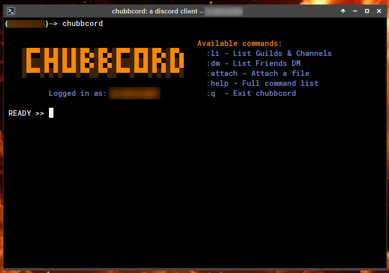
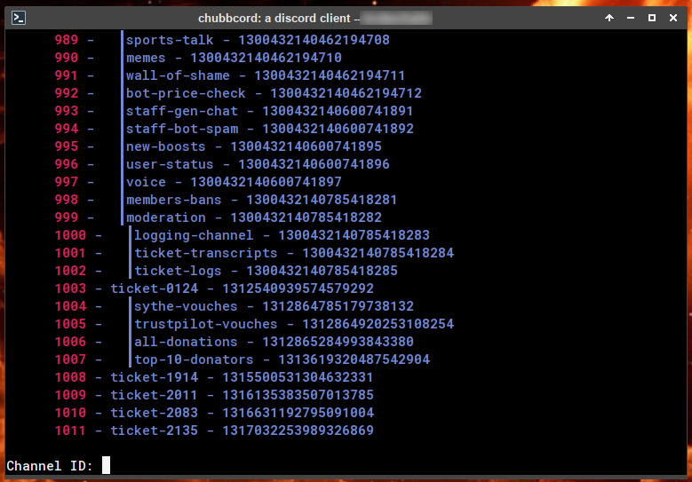
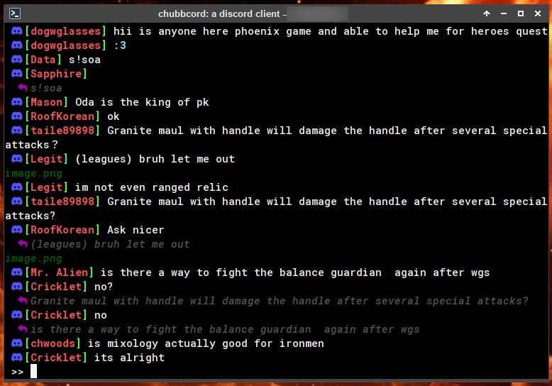
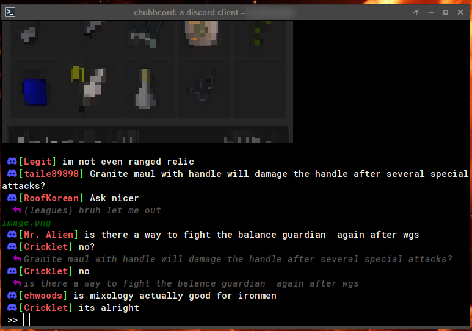

# chubbcord
**chubbcord** is a **Discord alternative client** as a **Command Line Interface (CLI) application**.
Yes, it might be **against Discord's TOS**. This is my first attempt at working with Python, and I am sure it shows. Feel free to provide feedback you have positive or negative, I can take it. chubbcord only uses HTTP requests to communicate with Discord's API, and **YES** I know there are better ways to do this.

By using **chubbcord**, you can safely talk with your friends on Discord in your company's open space, without having to worry about your boss seeing that you're not working. You will just look like a hacker, and that's cool. (If you disable images and videos, of course)

**THANK YOU** to Quentin Dufournet for developing 10cord which this is a customization of. When I found the project on github it instantly caught my interest and motivated me to seriously dig into Python. Please take a look and support the original project, as well as others he is working on. https://github.com/mcxiv/10cord


## Installation
```bash
git clone https://github.com/jimmycapizzi/chubbcord
cd chubbcord
python3 -m pip install .
```

### Optional
If you want to display images and videos in your terminal, you can install [chafa](https://github.com/hpjansson/chafa) (Linux only)

**Be careful, if enabled chubbcord automatically downloads any attachments to ~/.chubbcord/tmp**

```bash
# Arch Linux
yay -S chafa
sudo pacman -S chafa

# Debian
sudo apt install chafa
```

## Usage
```
chubbcord -h
usage: chubbcord [-h] [-e EMAIL] [-p PASSWORD] [-c CHANNEL] [-a] [-t TOKEN]

options:
  -h, --help            show this help message and exit
  -e EMAIL, --email EMAIL
                        User email
  -p PASSWORD, --password PASSWORD
                        User password
  -c CHANNEL, --channel CHANNEL
                        Channel ID to get messages from
  -a, --attach          Displays attachments (Requires chafa)
  -t TOKEN, --token TOKEN
                        Custom user token

```

### Authentication using custom token
If you want to use a custom token, you can use the `-t` option, along with your token.

If you do not care about security, or saving your token in plain text you you can have automatic logins.

```
~/.chubbcord/user.token.json
$ cat user.token.json
{
	"token": "YUgINOINoiJmO.you.get.the.idea.IUHhby9h.PnIOi"
}
```

### Selecting a channel
When you launch chubbcord, and type `:li` or `:dm`, a list of all your guilds and channels or friends will be displayed. You can select a channel by typing its ID and pressing enter.

**Be careful, the ID to input is the `local channel ID`, which is to the left of the channel name.**

You can also use the `-c` option to select a channel automatically (By using the Discord's ID). See [Usage](#usage).

### Welcome Screen




#### Guilds, Channels and Direct Messages



*** ":dm" is actually people you DMed. ***

### Sending messages
To send a message, just type it and press enter.

### Sending attachments
To send an attachment, type `:attach:<path>:<content>` and press enter. `<path>` is the path to the file, and `<content>` is the message to send with the attachment. If `<content>` is empty, the attachment will be sent without any message.

### Internal commands
- `:q` to quit the application
- `:attach:<path>:<content>` to send an attachment.
- `:cr` to refresh the screen
- `:help` to display the help message
- `:li` to list all guilds and channels
- `:dm` to list all friends
- `:we` to print the welcome message again





## Contributing
Pull requests are welcome.
